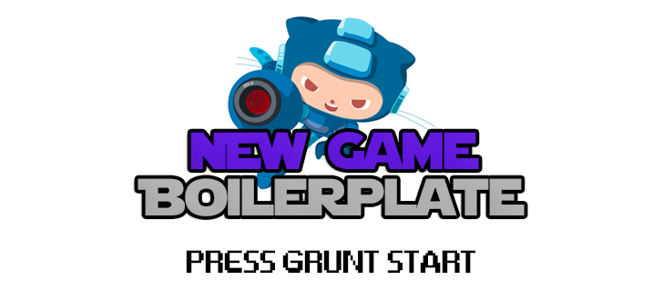

# 

> A Front-End boilerplate for help generate Single Pages Apps.

## Get to know the boilerplate

**Stack based in NodeJS**
- [Jade](http://jade-lang.com/)
- [Stylus](http://learnboost.github.io/stylus/)
- [GruntJS](http://gruntjs.com/)

**Vendors**
- Reset: [Normalize](https://necolas.github.io/normalize.css/)
- Grid: [Flex Grid Framework](http://flexgridframework.com/)

## Getting Started

**install the basic dependencies**

- [NodeJS](https://nodejs.org/en/)
- [GruntJS](http://gruntjs.com/)

**Clone this repository**
```sh
$ git clone git://github.com/afonsopacifer/new-game.git new_project
$ cd new_project
```

**Install dependencies**
```sh
$ npm install
```

**Watch the files to build and run a static server on http://localhost:9000/**
```sh
$ grunt start
```

## Folders Structure
	.
	├── README.md
	├── CONTRIBUTING.md
	├── LICENCE.md
	├── src/
	|   ├── index.jade
	|   ├── includes/
	|   |   ├── head-requests.jade
	|   |   ├── bottom-requests.jade
	|   |   └── analytics.html
	|   ├── styl/
	|   |   ├── vendors/
	|   |   |   ├── normalize.styl
	|   |   |   └── flex-grid-framework.styl
	|   |   └── style.styl
	|   ├── scripts/
	|   |   └── scripts.js
	|   └── img/
	├── build/
	|   ├── index.html
	|   ├── assets/
	|   |   ├── img/
	|   |   ├── css
	|   |   |   └── style.min.css
	|   |   └── js
	|   |   |   └── scripts.min.js
	├── Gruntfile.js
	├── package.json
	└── .gitignore

## Grunt Tasks

- `$ grunt build`: Compile, concat and minify all files.
- `$ grunt serve`: Watch the files to build and start a static server.
- `$ grunt autoprefixer`: Autoprefixer the css files.
- `$ grunt jade`: Compile jade files.
- `$ grunt stylus`: Compile stylus files.
- `$ grunt validation`: Validation the HTML files.
- `$ grunt lint`: Lint the css files.
- `$ JS hint`: Hint the JS files.
- `$ grunt imagemin`: Compress image files.
- `$ grunt svgmin`: Compress svg files.
- `$ grunt deploy`: Deploy for gh-pages.

## Contributing

Want to contribute? [Follow these recommendations](https://github.com/afonsopacifer/new-game/blob/master/CONTRIBUTING.md).

## Licence

[MIT Licence](https://github.com/afonsopacifer/new-game/blob/master/LICENCE.md) © [Afonso Pacifer](http://afonsopacifer.com/)
